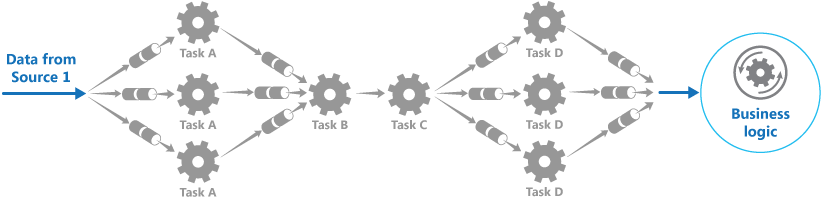
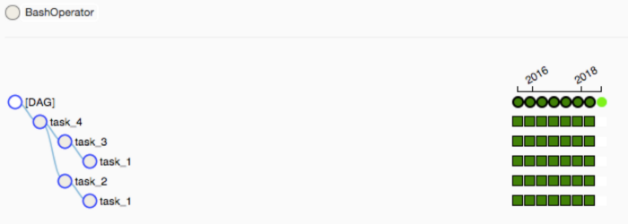

#### What can we use time series predictive pipeline for?
Time series data appear in every aspect of your life. If you care about the progression of things over time, then you care about time series data. With proper analysis and modeling, you can use historical time series to predict the future behavior of several phenomenons, from stock prices to future market demands. However, time series are tricky. It can get very large if you want to collect information at smaller intervals (for example, a day worth of trade data can get to several gigabytes if you try to collect data at microseconds intervals). This huge amount of data makes it hard, even impossible, to process and analyize. Some other problems include:

- **Stability**: How are we going to ensure that an issue in the middle of the pipeline won't make us re-start from the beginning?
- **Processing power**: How are we going to process large datasets without memory overflow?
- **Resource allocation**: How are we ensure that we only use computing resource only when we need it, preventing any resource allocation to stand-by applications?
- **Scalability**: How do we design a system that can be scaled up with larger datasets?
- **Reusability**: How do we re-use as much code and configs as we can, so we don't fall into architecture hell?

Let's address each of these problems in this series.

#### Achieve stability through Pipes and Filter design pattern


When we play games, would it be nice to have several checkpoints along the way, so if we happen to trip, we can just go back to the last checkpoint, instead of restarting the whole thing? Similarly, you don't want to have a long series of tasks for a program to do, without any checkpoint. This leads us to the Pipes and Filter design pattern. You ca read more about it here: [Pipes and Filter design pattern](https://docs.microsoft.com/en-us/azure/architecture/patterns/pipes-and-filters)



This pattern, in a nut shell, is just about splitting your pipeline into several steps. Some of the basic steps that you cna split your pipeline into are ingest, clean, and process. After each step, you can save your data into persistent storage, which will serve as input data source for the next step. In our example, I will split our predictive piepline into three main steps: ingest, clean, and process.

- **Ingest**: at this step, there will be a script that will pull data from sources such as PostgreSQL database, MySQL database, or csv files from a file system. The output of this step will be stored on local disk as csv files (the reason I chose csv files will be explained later).
- **Clean**: at this step, another script will pull data from our persistent storage (in this case, or local disk), perform clean tasks such as remove NaN values, parse the columns to correct data type, format column names, convert timestamp to datetime, etc., and save the files as Parquet.
- **Process**: at this stage, a script will perform data aggregation tasks such as joining, de-duplication, mutate columns, enriching, regex filtering, etc., basically anything that needs to be done to bring data to a state that is ready for us to perform machine learning analysis. The output of this stage will consist of model artifactsand our prediction dataset (stored as Parquet files)

Now that we have split our data pipeline into several steps, how should we orchestrate the whole thing? How can we make sure that the clean task will be triggered after ingest task and so on? To do that, we will use Airflow.

#### Airflow as a scheduling machine
Apache Airflow is a platform to programmatically create, schedule and monitor workflows. Workflows are created by interpreting a file called Directed Acyclic Graphs (DAGs), where you can define your tasks using predefined libraries. The Airflow scheduler executes your tasks on an array of workers while following the specified dependencies. The ability to define your workflows as code make your workflows more maintainable, versionable, testable, and collaborative.


Airflow is distributed as a Pypi package, so you can install it using `pip install`. Here is the link to the installation guide: [Install Apache Airflow](https://airflow.apache.org/docs/apache-airflow/stable/installation.html). However, in our example, I will choose the containerized distribution to speed up the process. To pull built Apache Airflow image from dockerhub, you can use this command:

```python
docker pull puckel/docker-airflow
```

To run DAG file, you need to place them in a folder, and perform a volume mapping to the Airflow container's `/usr/local/airflow/dags` directory:

```python
docker run -d -p 8080:8080 -v /path/to/dags/on/your/local/machine/:/usr/local/airflow/dags puckel/docker-airflow webserver
```

DAG files are simply python files. Here is a simple `HelloWorld.py` DAG file that you can use to test your Airflow installation:

```python
from airflow import DAG
from airflow.operators import BashOperator
from datetime import datetime, timedelta

# Following are defaults which can be overridden later on
default_args = {
    'owner': 'manasi',
    'depends_on_past': False,
    'start_date': datetime(2016, 4, 15),
    'email': ['manasidalvi14@gmail.com'],
    'email_on_failure': False,
    'email_on_retry': False,
    'retries': 1,
    'retry_delay': timedelta(minutes=1),
}

dag = DAG('Helloworld', default_args=default_args)

# t1, t2, t3 and t4 are examples of tasks created using operators

t1 = BashOperator(
    task_id='task_1',
    bash_command='echo "Hello World from Task 1"',
    dag=dag)

t2 = BashOperator(
    task_id='task_2',
    bash_command='echo "Hello World from Task 2"',
    dag=dag)

t3 = BashOperator(
    task_id='task_3',
    bash_command='echo "Hello World from Task 3"',
    dag=dag)

t4 = BashOperator(
    task_id='task_4',
    bash_command='echo "Hello World from Task 4"',
    dag=dag)

t2.set_upstream(t1)
t3.set_upstream(t1)
t4.set_upstream(t2)
t4.set_upstream(t3)
```

To run this DAG, simply log into your container using the following command:

```python
docker exec -ti <container name> bash
```

then run your DAG:

```python
airflow test Helloworld task_1 2015-06-01
```

Your output should look like this:



Congratulations! Now you have successfully deployed your first Apache Airflow instance. In the next part of the series, I will explain about each basic part of a DAG file, and how we can integrate Spark with Airflow to create our cleaning and processing steps. Feel free to contact me if you have any questions and need my help on this topic. See you next time!