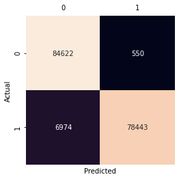

#### Imbalanced datasets problem.
Imbalanced datasets is the one of common phenomena of binary classification like spam email, fraud detection,... In case the data ratio between two class is 50:50, it is considered balanced. In the other case, when there is a difference between in the distribution between two class such as 60:40 or more than, the data is unbalanced.

Most datasets has a differnce in scale between two classes. For case, the data is sightly imbalanced, such as 60:40, it will not significantly affect the predictive ability of the model.

However, if the data imbalance is servere, such as 90:10 , the result of models have poor predictive performance, specifically in the minority class.

Imbalanced data pose a challenge for predictive modeling because most of machine learning algorithms used for classification were designed with assumption of an equal number of samples for each class.

In this post, we will discover **Credit Card Fraud Detection** datasets in _Kaggle_. And after this tutorial, you will know:

**What is Imbalanced datasets?**
**How do we handle with imbalanced datasets**
**Why handling imbalanced datasets is important?**

#### Overview the dataset
[Here is the dataset](https://www.kaggle.com/mlg-ulb/creditcardfraud)
We will load dataset and overview them.

```python
import numpy as np
import pandas as pd
import seaborn as sn
import matplotlib.pyplot as plt
from sklearn.model_selection import train_test_split
from sklearn import metrics

df = pd.read_csv("creditcard.csv")
df.columns
```

```css
Index(['Time', 'V1', 'V2', 'V3', 'V4', 'V5', 'V6', 'V7', 'V8', 'V9', 'V10',
       'V11', 'V12', 'V13', 'V14', 'V15', 'V16', 'V17', 'V18', 'V19', 'V20',
       'V21', 'V22', 'V23', 'V24', 'V25', 'V26', 'V27', 'V28', 'Amount',
       'Class'],
      dtype='object')
```
As you can see, dataset contains 31 columns, **Time** column: time for each transaction, **Amount**: transaction amount, **Class**: label 1 for fraudulent transaction, 0 for normal transaction. The other columns are **V1, V2,...V28** which have been reduced by PCA due to custommers information security issues.

```python
ax = sn.countplot(x="Class", data=df)
for p in ax.patches:
  ax.annotate(p.get_height(), (p.get_x() + p.get_width() / 2., p.get_height()),\
              ha = 'center', va = 'center', xytext = (0, 5), textcoords = 'offset points')
plt.title("Count plot for transactions")
plt.xticks([0, 1], ["Normal", "Fraud"])
plt.show()
```


As you can see, this dataset presents transactions occurred in two days, we have 492 frauts out of 284,807 transactions. This dataset highly unbalanced, the positive class (fraut) stand for 0.172% of all transactions. Given the class imbalance ratio, confusion matrix accurancy is not meaningfull for unbalanced classification.

#### Test imbalanced dataset using some simple models

Splitting datasets is essential for unbiased evaluation of prediction performance. In most case, we often split our dataset into there subsets.
- **The training set** is applied to train or _fit_ our model
- **The validation set** is used for unbiased model evaluation during _hyperparameter tuning_
- **The test set** is needed for unbiased evaluation of the final model. You shouldn't use it for training or validation.

##### Split the original dataset

```python
train , test = train_test_split(df , train_size=0.7, random_state=0)
x_train , y_train = train[feature_columns], train["Class"]
x_test , y_test = test[feature_columns], test["Class"]
```

We also use a function named **evaluate_result** for result evaluation.
```python
def evaluate_result(actual, predict):
  confusion_matrix = metrics.confusion_matrix(actual, predict)
  accuracy_score = metrics.accuracy_score(actual, predict)
  precision_score = metrics.precision_score(actual, predict)
  recall_score = metrics.recall_score(actual, predict)
  f1_score = metrics.f1_score(actual, predict)

  sn.heatmap(confusion_matrix,cbar=False,annot=True,square=True,fmt="d")
  plt.tick_params(axis='both', which='major', labelsize=10, labelbottom = False, bottom=False, top = False, labeltop=True)
  plt.xlabel("Predicted")
  plt.ylabel("Actual")

  print("accuracy:",accuracy_score)
  print("precision:",precision_score)
  print("recall:",recall_score)
  print("f1 score:",f1_score)
```

##### Test without sampling
Oke, we use **Random Forest** and **Logistic Regression** algorithms for our model. Let import the necessary library.

```python
from sklearn.ensemble import RandomForestClassifier
from sklearn.linear_model import LogisticRegression
```

- **Random Forest**

```python 
# Random forest classifier
clf = RandomForestClassifier(max_depth=2, random_state=0)
clf.fit(x_train, y_train)
y_pred = clf.predict(x_test)
evaluate_result(y_test, y_pred)

# accuracy: 0.9990519995786665
# precision: 0.8586956521739131
# recall: 0.5374149659863946
# f1 score: 0.6610878661087867
```


- **Logistic Regession**

```python
# Logistic Regression Classifier
lr_clf = LogisticRegression(max_iter=1e5, random_state=0)
lr_clf.fit(x_train, y_train)

lr_y_pred = lr_clf.predict(x_test)
evaluate_result(y_test, lr_y_pred)

# accuracy: 0.9991456292499094
# precision: 0.87
# recall: 0.5918367346938775
# f1 score: 0.7044534412955464
```


#### Test imbalanced dataset after resampling using SMOTE technique.

To handle with imbalanced problem in this dataset, we need to use a sampling method, specifically using SMOTE (Synthetic Minority Over-sampling Technique) to resampling the data related fraudulent transactions. The idea is quite similar to kNN algorithm, the new minority samples are created by summing the samples closest to the sample under consideration. By the way, the number of samples belonging minority class will increase and equalize the majority class.

```python
from  imblearn.over_sampling  import  SMOTE
from collections import Counter

oversample = SMOTE()
X_new , y_new = oversample.fit_resample(df[feature_columns], df["Class"])

counter = Counter(y_new)
print(counter)

ax = sn.countplot(y_new)
plt.title("Count plot for Class after resampling")
for p in ax.patches:
  ax.annotate(p.get_height(), (p.get_x() + p.get_width() / 2., p.get_height()),\
              ha = 'center', va = 'center', xytext = (0, 5), textcoords = 'offset points')
plt.xlabel("Class")
plt.xticks([0, 1], ["Normal", "Fraud"])
plt.show()
```


##### Test after resampling

```python
### Random Forest Classifier
rf_clf = RandomForestClassifier(max_depth=2, random_state=0)
rf_clf.fit(x2_train, y2_train)
y2_pred = rf_clf.predict(x2_test)
evaluate_result(y2_test, y2_pred)

# accuracy: 0.957019503016021
# precision: 0.9930417871620342
# recall: 0.9206129927297845
# f1 score: 0.9554567325216885
```



```python
# Logistic Regression
lr_clf = LogisticRegression(random_state=0, max_iter=1e5).fit(x2_train, y2_train)
lr_y2_pred = lr_clf.predict(x2_test)
evaluate_result(y2_test, lr_y2_pred)

# accuracy: 0.9580863947851268
# precision: 0.9665581744697593
# recall: 0.9491319058267089
# f1 score: 0.957765780240292
```

**The precision, recall, F1-score scores were improved and achieved high scores(>0.9). That means after resampling to  handle imbalanced dataset helps the models to predicts better, which can be applied to real problem.


#### Conclusion

[You can view full code here](../assets/code/smote.py)