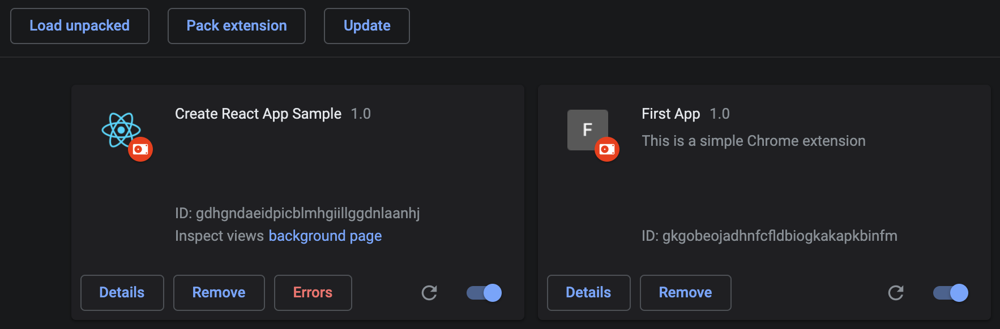
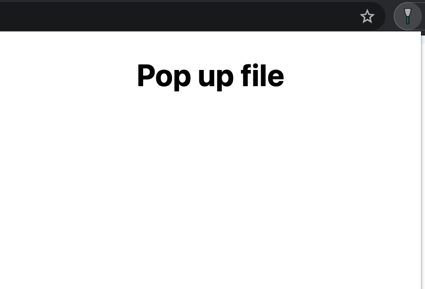

## What is a Chrome Extension?

> Chrome extensions are programs you can install in your Chrome browser to change its functionality.

These extensions can help you automate certain functions in your Chrome browser, improve your software's convenience. Even that can improve your SEO.

The only difference between your Chrome extension and a regular website is Chrome extension has a **manifest** file. Another way to think about that Chrome extension is a piece of code that change your experience.

## You step by step to create Chrome extension.

### Manifest file

The first step is creating a **manifest.json** file. This serves a similar purpose to **package.json**. This provides some critical information about own Chrome extension, including **version, name, requirements permission and so on**. 

```js
{
    "manifest_version": 2,
    "name": "First App",
    "version": "1.0",
    "description": "This is a simple Chrome extension",
    "permissions": ["activeTab", "declarativeContent", "storage", "<all_urls>"],
    "content_scripts": [{
        "matches": ["<all_urls>"],
        "css": ["background.css"],
        "js": ["background.js"]
    }],
    "browser_action": {
        "default_title": "Does a thing when you do a thing",
        "default_popup": "popup.html",
        "default_icon": {
            "16": "icons/icon16.png",
            "32": "icons/icon32.png"
        }
    }
}
```

Some fields, including **manifest_version, name, version, description** are required. The **permissions** depend on what your extension needs to do.

The **content_script.js** sections: Content scripts are files that run in the context of web pages. By using the standard Document Object Model (DOM), they are able to read details of the web pages the browser visits, make changes to them, and pass information to their parent extension. We will discuss about it later.

```javascript
"content_scripts": [
   {
     "matches": ["<all_urls>"],
     "css": ["content.css"],
     "js": ["content.js"]
   }
 ]
 ```
 
 The **browser_action**: Use browser actions to put icons in the main Google Chrome toolbar, to the right of the address bar. In addition to its icon, a browser action can have a tooltip, a badge, and a popup.

 ```javascript
"browser_action": {
   "default_title": "Does a thing when you do a thing",
   "default_popup": "popup.html",
   "default_icon": {
     "16": "icons/icon16.png",
     "32": "icons/icon32.png"
   }
 }
 ```

### Debugging

**manifest,CSS and javascript** file are already, next step we open [chorome extension](chrome://extensions/) from the browser's address bar and enable developer mode. Click **Load unpackage** and navigate the folder contains own Chrome extension.

The Chrome extension needs to be reloaded when it is updated. Now, we have a litte icon **refresh**. If the extension has any errors came up, it also will a small **error** button, you can click that buttton it shows you the stack trace and more information here as well.



### Popup page

Now that we've written manifest file, we can figure out what our chrome extension should be displayed by using **pop up functionality**. How to do that? Very easy, in **browser action** in the manifest file, you need to define **default_popup and default_icon**. We have a simple HTMl file here.

```html
<!DOCTYPE html>
<html lang="en">
<head>
    <meta charset="UTF-8">
    <meta http-equiv="X-UA-Compatible" content="IE=edge">
    <meta name="viewport" content="width=device-width, initial-scale=1.0">
    <title>Document</title>
    <style>
        body{
            width: 400px;
            height: 600px;
        }
        h2 {
            font-size: 30px; 
            text-align: center;
        }
    </style>
</head>
<body>
    <h2>Pop up file</h2>
</body>
</html>
```




### Load your Chrome Extension

To load your extension in Chrome, open up [Here](chrome://extensions/) in your browser and click **Developer mode** in the top right. Now click **Load unpacked extension…** and select the extension’s directory. You should now see your extension in the list.

When you change or add code in your extension, just come back to this page and reload the page. Chrome will reload your extension.

### Running script

A content script is “a JavaScript file that runs in the context of web pages.” This means that a content script can interact with web pages that the browser visits. Not every JavaScript file in a Chrome extension can do this; we’ll see why later.

We have a **content script** file:

```javascript
alert("Hello, I come from content script file");
```

To inject the script, you need to tell **manifest file** about it.

```javascript
"content_scripts": [{
    "matches": ["<all_urls>"],
    "css": ["content.css"],
    "js": ["content.js"]
}],
```

This tells Chrome to inject **content.js** into every page we visit using _"<all_urls>"_. If you only want to inject script on only some pages, you need specific the pattern of pages. Example: 
- ["https://mail.google.com/*", "http://mail.google.com/*"] injects our script into HTTPS and HTTP Gmail. If we have / at the end instead of /*, it matches the URLs exactly, and so would only inject into https://mail.google.com/, not https://mail.google.com/mail/u/0/#inbox. Usually that isn’t what you want.
- http://*/* will match any http URL, but no other scheme. For example, this won’t inject your script into https sites.

Reload Chrome Extension and view your result.


### Uploading to the Chrome Web Store

Now, we get to head over to [Chrome Web Store](https://accounts.google.com/ServiceLogin/webreauth?service=chromewebstore&hl=vi&authuser=0&continue=https%3A%2F%2Fchrome.google.com%2Fwebstore%2Fdevconsole%2F&passive=180&flowName=GlifWebSignIn&flowEntry=ServiceLogin) to submit our extension. 

