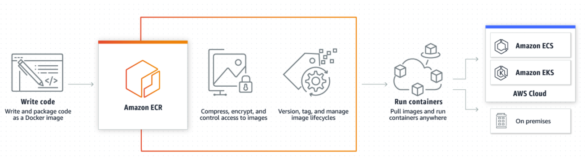

## Problems
I have a web application to sentiment comments of a university. We apply BERT, a popular Transform model to sentiment comments is Positive or Negative. To do that, I have to use an EC2 instance that is powerful enough for the training and validation model. In addition, it must ensure availability, on the other hand, it must save costs and can serve many people at the same time. 


### What we'll cover in this tutorial?
1. Building a container image to sentiment text comments
2. Setting up ECS Anywhere
3. Setting up ECS Fargate for Master Node
4. Defining ECS Task 
5. Setting up AIM role and Policies
6. Running the task
7. Creating a serverless application
8. Configuration and settings
9. Setting up SQS message
10. Setting up S3 service
11. Setting up RDS
12. Request to API Gateway and trigger Lambda function


## Workflow


1. User upload a text file Comments to S3
2. Backend generates a request id and request an API call
3. API Gateway trigger Lambda
4. Lambda send a message to SQS queue, Lambda spin up a master node to manage resource and behaviors of EC2
5. Worker node get request-id from SQS queue   
6. Worker node get data from S3 using request_id
7. Worker node process data, after then write CSV file processed to S3 again
8. Backend get CSV file processed from S3
9. Backend upload data into database
10. Client waits for data with a request_id, if data is already in RDS, return data to the client
11. Return data processed.


## Build the Docker container image (worker node)
We will encapsulate the core functionality - sentiment comments from  a CSV file in a container.

Let's look at the Dockerfile and see how we would execute it.


## Setting up and Use Amazon’s Elastic Container Registry

### How it works
>Amazon ECR is a fully managed container registry offered as part of the AWS suite. Like Docker Hub, it makes storing, sharing, managing, and deploying your images easier, but it’s also likely to save you money - especially if you’re already using AWS. Simply push your images to ECR and pull the images using container management tool: Kubernetes, Docker Compose, ECS, EKS, etc.


### Creating a New Repository
Assuming you've already got AWS account and permissions correctly configured, the easiest to get started is to create a new ECR repository via the AWS UI.

Go to the ECR homepage and click **Create repository**, where you can enter all the details for the new your repository


### Configuring Your Repository


Choose a visibility settings(Public or Private), name the repository, and select any of the options you need for creating the repository. There are have some options:
- **Tag immutability**: The tag immutability setting determines whether the image tags in the repository can be overwritten. When tag immutability is enabled, if an image is pushed to the repository with a tag that already exists, an error will be received. This setting can be changed for a repository at any time.
- **Scan on push**: Your images will be scanned for security vulnerabilities each time a new tag is pushed.
- **KMS encryption**: Allows you to use AWS Key Management Service (KMS) to encrypt images in this repository.

>Note: your repository URL structure will be something like this: 

```
    <account-id>.dkr.ecr.<account-region>.amazonaws.com/<repository-name>
```
Once your repository is configured. Now we will move next step, Dockerize and Pushing an image.


### Dockerfile.worker
```python
FROM tensorflow/tensorflow:latest-gpu

# set the working directory in the container
WORKDIR /sentiment

# copy the dependencies file to the working directory
COPY requirements.txt .

# install dependencies
RUN pip install -r requirements.txt
RUN pip install spacy
RUN pip install tensorflow==2.5.0
RUN pip install SQLAlchemy
RUN pip install psycopg2-binary

# copy the content of the local src directory to the working directory
COPY . .

# command to run on container start
CMD [ "python", "sentiment_analysis_inference.py" ]

```

I use the image **tensorflow/tensorflow:latest-gpu**, and then install python dependencies, update tensorflow 2.5.0 for compatibility. I also install **SQLAlchemy and psycopg2** library to worker node update status on _trace table_

Now that we have looked at the Dockerfile.worker, we will download and build the image in our machine.


```python

```

### Pushing an Image to the Repository
Before publishing the Image to ECR repository, make sure you have Docker installed in your computer and a project with a _Dockerfile_ that's already to be built and push to ECR.

#### Configure AWS credentials on the CLI
```python
aws configure
```

You need pass your _AWS Access Key_ and _Secret Access Key_. It allows your CLI instance access to AWS service.


#### Adding your ECR credentials to Docker CLI
Next, you need Docker to be able to push images to your ECR repository. The docker login command will allow you to do this, so using the AWS CLI, retrieve your ECR password and pipe it into the Docker command:

```python
aws ecr get-login-password \
    --region <account-region> \
| docker login \
    --username AWS \
    --password-stdin <account-id>.dkr.ecr.<account-region>.amazonaws.com/<repository-name>
```
After authentication, you will see **Login Succeeded** as a response. Now you’ll be able to push tagged images to your ECR repository.

If you are pushing or pulling images from this machine regularly, you may not want to go through this login process every time. Instead of using **docker login**, you can configure the Amazon ECR Docker Credential Helper to give the Docker daemon direct access to your AWS credentials. This method is also convenient for CI environments because it automates the authentication process and caches tokens to minimize your risk of being throttled.

#### Pushing an Image to ECR
We will build the Image from Dockerfile.worker

```python
docker build -f Dockerfile.worker -t <account-id>.dkr.ecr.<account-region>.amazonaws.com/<repository-name>:<image-version> .
```

Okay!!! Your image is already to push ECR.

```python
docker push <account-id>.dkr.ecr.<account-region>.amazonaws.com/<repository-name>:<image-version>
```

## Build the Docker container image (master node)


```python
FROM python:3.8

# set the working directory in the container
WORKDIR /manager_node

# copy the dependencies file to the working directory
COPY requirements_manager.txt .

# install dependencies
RUN pip install -r requirements_manager.txt

# copy the content of the local src directory to the working directory
COPY . .

# command to run on container start
CMD [ "python", "manager.py" ]
```


## Setup ECS anywhere
>Amazon Elastic Container Service (ECS) Anywhere is a feature of Amazon ECS that enables you to easily run and manage container workloads on customer-managed infrastructure. 

>ECS Anywhere builds upon the ease and simplicity of Amazon ECS to provide a consistent tooling and API experience across your container-based applications. Whether on-premises or in the cloud, you'll have similar cluster management, workload scheduling, and monitoring you've come to know from Amazon ECS. Reduce costs and mitigate complex local container orchestration by taking advantage of the completely managed solution that ECS Anywhere provides. ECS Anywhere helps you meet compliance requirements and scale your business without sacrificing your on-premises investments.

Some benifits:
- Fully managed cloud control plane
- Consistent tooling and governance
- Manage your hybrid footprint

### Spin Up an EC2 GPU instance for deep learning training and inference 

Whenever you need to build advanced deep learning projects in the cloud, it's easy way to get started by using AWS. You can

>This section focuses on the **AWS deep learning AMIs** , which let you build custom environment and workflow. Both Amazone SageMarket and AMIs come preinstalled with popular open-source deep learning frameworks, including Tensorflow, docker, Apache MXNet, Pytourch,.... which are optimized for high performance on AWS.

The AMIs offer GPU acceleration through pre-configured CUDA and cuDNN drivers, and CPU acceleration through Intel MKL-DNN drivers. The AMIs are available for both Ubuntu (16 and 18) and Amazon Linux (1 and 2), and come bundled with popular data science and Python packages. You can choose either Conda AMIs with preinstalled frameworks and drivers in separate virtual environments, or base AMIs that allow end-to-end customization.

#### Lauching instance
##### On AWS Management Console, open the EC2 console -> choose **Lauch instance**


##### Choose an Amazone Machin Image (AMI)

- Choose AWS marketplace

- Find "Deep learning AMI version 46.0"


##### Choose an Instance Type
- In my case, I will choose G4ad.xlarge. 


##### Configure Instance Details

- You must specify your VPC
- After then specify the subnet
- Click "Protect against accident termination". In AWS, when you click **terminated**, you will not recover data in the images which you deleted.


##### Add Storage


##### Configure Security Group
- A security group acts as a virtual firewall for your instance to control inbound and outbound traffic. You can assign up to five security groups to the instance.

- For each security group, you can add more rules that control inbound traffic. 

- You may also set up ALCs (Access Control List) with rules similar to your security groups

- In my case, I want to access the EC2 to monitor docker logs. So I just add a rule, which exposed at 22 port.


##### Review and Lauch


##### Result


### Set up GPU within a Docker Container on EC2 Instance

#### SSH to EC2 Instance
Firstly, you need SSH to EC2 Instance. 
```python
ssh -i <your_key_per> ubuntu@<your_public_ec2_ip>
```

#### Setting up Docker
Docker-CE on Ubuntu can be setup using Docker’s official convenience script:
```python
curl https://get.docker.com | sh && sudo systemctl --now enable docker
```


#### Setting up NVIDIA Container Tookit
```python
distribution=$(. /etc/os-release;echo $ID$VERSION_ID) \
   && curl -s -L https://nvidia.github.io/nvidia-docker/gpgkey | sudo apt-key add - \
   && curl -s -L https://nvidia.github.io/nvidia-docker/$distribution/nvidia-docker.list | sudo tee /etc/apt/sources.list.d/nvidia-docker.list
```
Install the nvidia-docker2 package (and dependencies) after updating the package listing:

```python
sudo apt-get update
sudo apt-get install -y nvidia-docker2
sudo systemctl restart docker
```

At this point, a working setup can be tested by running a base CUDA container:
```python
sudo docker run --rm --gpus all nvidia/cuda:11.0-base nvidia-smi
```

This should result in a console output shown below:


### Setting up ECS Cluster and register ECS to EC2 External instance


End then, you need copy this command and move EC2 instance, run that command


## Set up ECS Fargate for Master node

### Dockerfile.manager
```python
FROM python:3.8

# set the working directory in the container
WORKDIR /manager_node

# copy the dependencies file to the working directory
COPY requirements_manager.txt .

# install dependencies
RUN pip install -r requirements_manager.txt

# copy the content of the local src directory to the working directory
COPY . .

# command to run on container start
CMD [ "python", "manager.py" ]
```

### Push to ECR

```python
docker build -f Dockerfile.manager -t <account-id>.dkr.ecr.<account-region>.amazonaws.com/<repository-name>:<image-version> .
```


```python
docker push <account-id>.dkr.ecr.<account-region>.amazonaws.com/<repository-name>:<image-version>
```

## Set up Lambda and API Gateway

### Setting up Lambda Serverless
>AWS Lambda is a serverless compute service that lets you run code without provisioning or managing servers, creating workload-aware cluster scaling logic, maintaining event integrations, or managing runtimes. With Lambda, you can run code for virtually any type of application or backend service - all with zero administration. Just upload your code as a ZIP file or container image, and Lambda automatically and precisely allocates compute execution power and runs your code based on the incoming request or event, for any scale of traffic. You can set up your code to automatically trigger from over 200 AWS services and SaaS applications or call it directly from any web or mobile app. You can write Lambda functions in your favorite language (Node.js, Python, Go, Java, and more) and use both serverless and container tools, such as AWS SAM or Docker CLI, to build, test, and deploy your functions.


### Serverless.yml file and Serverless Framework Documentation
>Develop, deploy, troubleshoot and secure your serverless applications with radically less overhead and cost by using the Serverless Framework. The Serverless Framework consists of an open source CLI and a hosted dashboard. Together, they provide you with full serverless application lifecycle management.

**Yml file**: 
```python
service: sentiment
useDotenv: true

plugins:
  - serverless-pseudo-parameters
  - serverless-python-requirements

custom:
  execRoleArn: { "Fn::Join" : ["", [ "arn:aws:iam::", { "Ref" : "AWS::AccountId" }, ":role/ecsTaskExecutionRole" ] ] }

provider:
  name: aws
  runtime: python3.7
  profile: <your_aws_profile>
  environment:
    ACCESS_ID: <your_access_id>
    ACCESS_KEY: <your_access_key>
    FARGATE_CLUSTER: aws-async
    FARGATE_TASK_DEF_NAME: <your_task_definition>
    FARGATE_SUBNET_ID: <your_subnet_id>
    REGION: <your_region>
    CONTAINER_NAME: <your_container_name>
    INSTANCE_ID: <your_g4_instance_id>
    QUEUE_URL: <your_queue_url>
  iamRoleStatements:
    - Effect: Allow
      Action:
        - execute-api:Invoke
      Resource: "arn:aws:execute-api:*:*:*"
    - Effect: Allow
      Action:
        - "ec2:*"
      Resource: "*"

functions:
  trigger_manager_ecs:
    handler: handler.trigger_manager_ecs
    timeout: 900
    vpc:
    events:
      - http:
          path: /
          method: get
          request:
            parameters:
              querystrings:
                request_id: true

```


### Deploy serverless.yml file

```python
aws configure --profile <your_profile_name>
```
After you configure the aws profile, then you need to deploy to lambda and APIGateway

```python
aws deploy --profile <your_profile_name --region <your_region_name>
```


## Setting up SQS queue
>Amazon Simple Queue Service (SQS) is a fully managed message queuing service that enables you to decouple and scale microservices, distributed systems, and serverless applications.

SQS eliminates the complexity and overhead associated with managing and operating message-oriented middleware, and empowers developers to focus on differentiating work. Using SQS, you can send, store, and receive messages between software components at any volume, without losing messages or requiring other services to be available

On SQS dashboard, we will create a SQS queue


Pass your queue service name


## Conclusion


